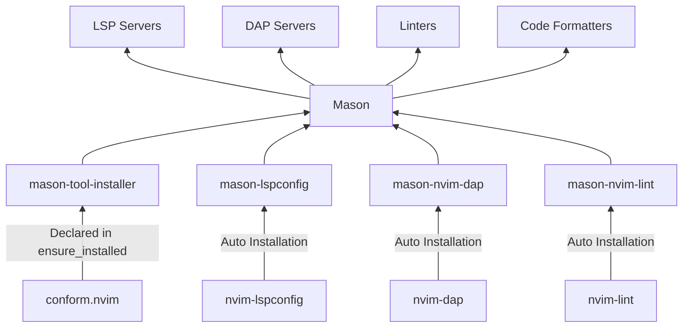

# Resolve System Dependencies
```shell
source <(curl -s https://raw.githubusercontent.com/DaniloMekic/dotfiles/refs/heads/main/bootstrap)
bootstrap_nvim
```

# Core Plugin Stack
- **Language Server Protocol** (LSP) **Server Management**: [Mason](github.com/mason-org/mason.nvim)
- **Code Formatrer Runner**: [Conform](https://github.com/stevearc/conform.nvim)
- **Linter Engine**: [nvim-lint](https://github.com/mfussenegger/nvim-lint)
- **Code Completion Engine**: [blink.cmp](https://github.com/Saghen/blink.cmp)
- **Snippet Engine**: [LuaSnip](https://github.com/L3MON4D3/LuaSnip)
- **Debug Adapter Protocol** (DAP) **Client**: [nvim-dap](https://github.com/mfussenegger/nvim-dap)
- **Picker**: [Fzf-Lua](https://github.com/ibhagwan/fzf-lua)

## Mason Architecture


LSPs are automatically enabled via `mason-lspconfig`, there is no need to call `vim.lsp.enable({name})`.

# Update All Plugins
```lua
--- https://neovim.io/doc/user/pack/#vim.pack.update()
vim.pack.update()
```
